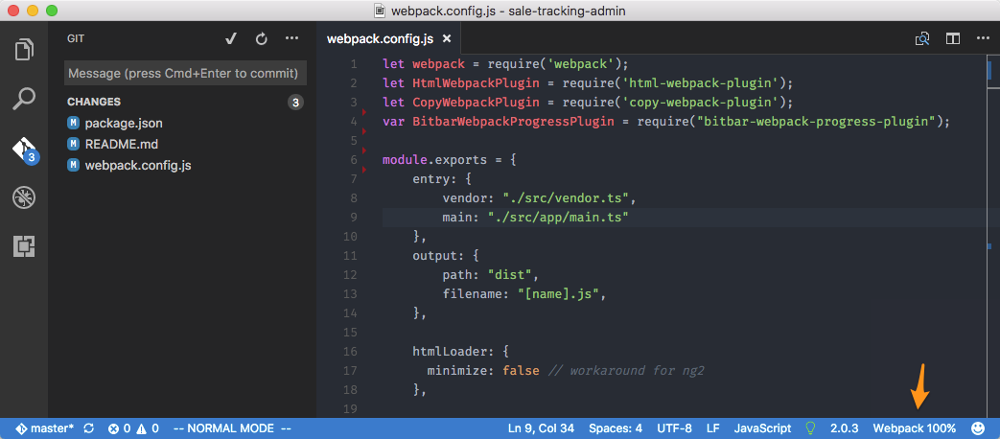

## Webpack Progress

Show webpack build progress in Visual Studio Code status bar.

## Requirement

- [BitBarWebpackProgressPlugin](https://github.com/wk-j/bitbar-webpack-progress-plugin)

## Install

- <kbd>Command</kbd>+<kbd>Shift</kbd>+<kbd>P</kbd>
- Type: `ext install webpack-progress`
- Press <kbd>Enter</kbd>